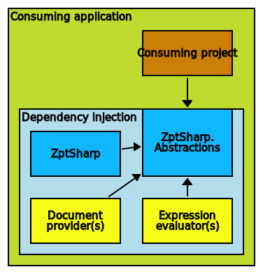

# ZptSharp architecture
The ZptSharp architecture is shown in this diagram.

## ZptSharp core
The core of ZptSharp provides the logic to coordinate the document/file rendering process. It also contains logic to evaluate the core expression types.

Alone, the ZptSharp core is not sufficient to render & write documents. You must also choose and install a **document provider** plugin. **Expression** plugins, on the other hand, are optional. 

## Document provider plugins
For a complete/working ZptSharp environment, you must install a document provider plugin.

Each document provider contains implementation-specific logic for reading & writing either HTML or XML documents. The ZptSharp core contains only an abstraction for working with document-specific APIs.

### List of document provider plugins
There are three officially-supported document provider plugins:

* **XML document provider** - facilitates reading/writing XML documents using the API from the `System.Xml.Linq` namespace.
* **AngleSharp document provider** - facilitates reading/writing HTML documents via the open source AngleSharp library.
* **HAP document provider** - facilitates reading/writing HTML documents via the open source HTML Agility Pack library.

## Expression plugins
Expression plugins allow ZptSharp to evaluate expression types beyond those included in the core.

ZptSharp includes support for a number of expression types *without need for expression plugins*. You only need to install any expression plugins if you wish to use the expression type it provides.

### List of expression plugins
These are the expression plugins which are officially supported.

* **Python expressions** - facilitates evaluating expressions written using Python 2 (via the open source IronPython library)
* **CSharp expressions** - facilitates evaluating expressions written in C#

## Wiring everything up
ZptSharp uses dependency injection (DI) to 'wire up' the selected plugins to be used by the core. This DI should be configured by the consuming application.

ZptSharp uses `IServiceCollection` & `IServiceProvider` from **Microsoft.Extensions.DependencyInjection**. Extension methods are provided, in the `ZptSharp` namespace, for registering and activating these components/plugins in your application.